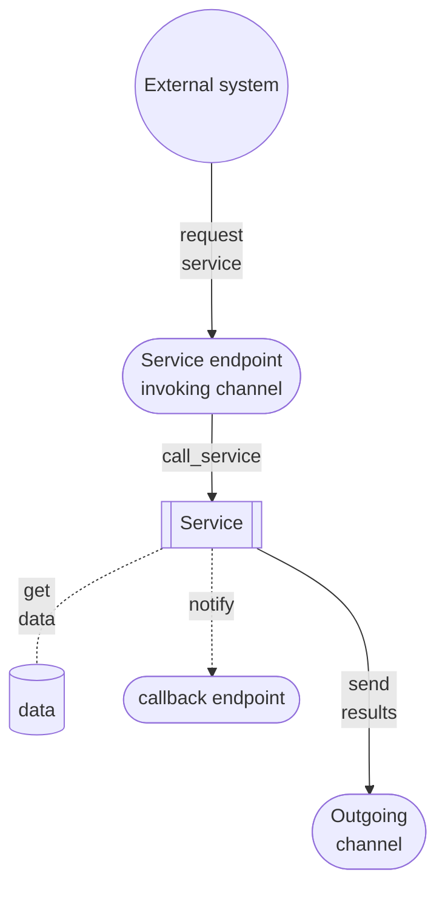

{ width="55" align=left }
<small markdown>**ALPHAREN CORE-Integrator (ARINT) System**<br>
*(c) 2021 RENware Software Systems. RESTRICTED only for project internal use*
</small><br><br><br>


# Service anatomy


<small markdown>

Product 0000-0156 0.0 document control:

* 210728 me new doc
* 230817 me last update
</small>

***Table of contents:***

[TOC]

***


A service must be written in Python then deployed to **ARSRV** in order to be used.

## Service skeleton

A service has the following high level flow:

* defines a handler in order to be accessed by ARSRV
* it is invoked through a channel
* obtain any required parameters in order to properly do its job
* connects to another channel to read required input, or directly read it, or obtain it from other service, etc (here we are in Python)
* make the necessary transformation over obtained data
* connects to an outgoing channel to write computed output
* log any process details for future references and errors debugging





### Detailed operations

A service consists of a class which gives **its name**. This class must contain a method named **`handler`** each is called by ARSRV to execute the service. 

```
# -*- coding: utf-8 -*-
# zato: ide-deploy=True

from zato.server.service import Service

class GetUserDetails(Service):
    """ Returns details of a user by the person's ID.
    """
    name = 'api.user.get-details'

    def handle(self):

        # For now, return static data only
        self.response.payload = {
            'user_name': 'John Doe',
            'user_type': 'SRT'
        }
```

The above example contains:

* first line is a comment for Python but will give important information to ARSRV ref service code serialization, useful to duplicate / copy the service on all servers (for load balancing and fail safe purposes).
* second line is a comment too but for Visual Code IDE  add on to know that service should be automatically deployed at save.
* next is a Zato (part of ARSRV) library for right using services
* `self.response.payload` is the property where response must be returned from service processing; this property will be used by ARSRV as response of the service 
* `name` will be the name of this service ad used by ARSRV
* the long comment (standard Pyyhon style for a multi line long string) will be used by ARSRV as service description

*NOTE. The response format could be anything you want, but for a better serial, serialization and conversion to output channel format, IT IS RECOMMENDED TO USE A DICTIONARY for response payload.*


## Deployment

In order to deploy this service the following methods could be used:

* directly from IDE if the corresponding extension was installed - this depends by IDE platform - VS Code has an already written extension 
* putting it in directory `~/env/qs-1/server1/pickup/incoming/services` and will be loaded automatically by an ARSRV, server1 shown in path (recommend for automate deployment)
* upload from ARSRV administration console (Services > List > Upload...)

In all cases the deployment ARSRV will distribute the service on all cluster's servers.


## Using in real cases

In most cases will want to access this service by a request from other system. Therefore will be needed a channel (as endpoint) where to invoke the service and sending it data (pls remember that ***anything that is outside ARSRV is 'linked' to ARSRV thru  channel***).

There could be cases when want that the service to run automatically driven by a scheduler. As long as ARSRV has its own scheduler, there is not need a channel to invoke the service.

And finally, the service can be invoked by other external event, like a new file in a directory, an updated file, a change in a database, a new message in a queue, a mail, etc. These aspects are ***subject to channels*** and will be treated there.

To produce an usable result, of course, the service must be linked to a channel which will receive response.


