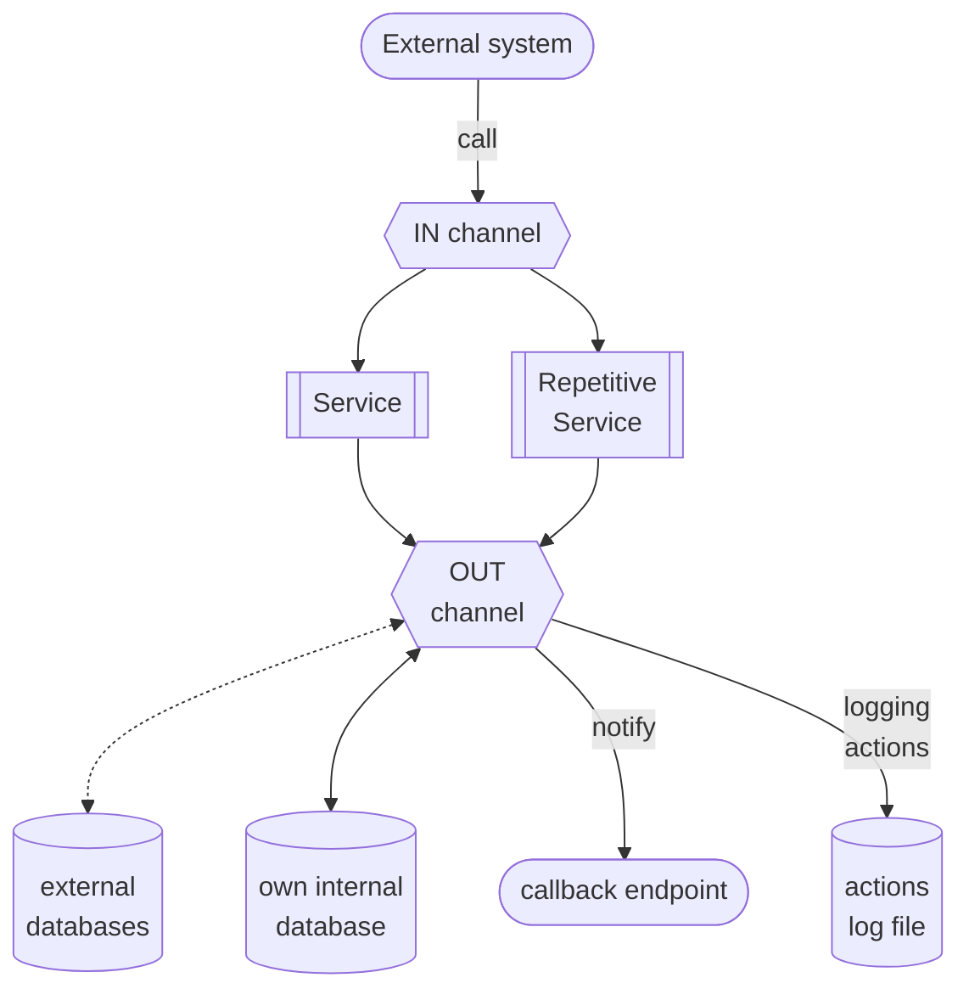

{ width="55" align=left }
<small markdown>**ALPHAREN CORE-Integrator (ARINT) System** 
*(c) 2021 RENware Software Systems. RESTRICTED only for project internal use*
</small>      

# Core-Integrator System Overview

***Table of contents:***

[TOC]

***

## What is ARINT Core

**ALPHAREN Core Integrator** (aka **`ARINT`** or **`arint`**) system is a framework product for automation, integration and interoperability between _distributed systems_ or _data sources_ basically aimed to build _API oriented_, _middleware_, _frontend_ and _backend_ applications.

Practically it allows to create small-footprint and focused *business oriented microservices* or to transform "monolith" applications to micro-applications that will act *as a single one* but with a high degree of *maintainability*.

Product is available as *distinct software* or as *ready to run appliance* (including also some built-in components such as an internal database for business operations).

!!! tip "ARINT as Service bus"
    ARINT acts as a high level *Service BUS* (ie, ESB or ESOA) to connect different micro-services and to make them to work ***as one***. As example it is already used by all *RENware Software Systems* products. Of course it can be used for **CUSTOMER SYSTEMS and SERVICES** too.

**ARINT** generic process flow is:

!!! info "Remarks to diagram"
    * practically an `IN channel` establish a way to address the ARINT system, how to call it
    * a `Repetitive Service` is normally called once (ie, to start it) and it begins to repeat operations (in background) at *defined time intervals* and for a *defined period* (or indefinitely)

## Availability and system "presence"

* **ANYWHERE**. can work even the systems that must be integrated are in different non routable LANs (address systems at `http` protocol level)

* **ANYHOW**. is agnostic to format, composition, structure, encoding of information required / provided by systems that must be integrated

* **ANYTIME**. can work as a distributed high scalable cluster of "**ALPHA-REN Integrator Machines**"

* **SECURED**. can work with any public standard (ie, defined at least as `RFC`) of Internet security

>Each ARINT system (cluster containing one or more servers) can run on premises or in cloud deployed as classic software or Docker application container, Kubernetes node / container or as any general containerization "standard" method.

## Features

For [features list go here](./810.46-Product_Features.md)

## Typical use cases

***ALPHAREN CORE-Integrator*** is used for enterprise, business integrations, data science, IoT and other scenarios that require integrations of multiple systems.

Real-world, production ***ALPHAREN CORE-Integrator*** environments include:

* A platform for processing payments from consumer devices

* A system for a telecom operators integrating CRM, ERP, Billing and other systems as well as applications of the operator’s external partners

* A data science system for processing of information related to securities transactions (FIX)

* A platform for public administration systems, helping achieve healthcare data interoperability through the integration of independent data sources, databases and health information exchanges (HIE)

* A global IoT platform integrating medical devices

* A platform to process events produced by early warning systems, (ex SAP EWS)

* Backend e-commerce systems managing multiple suppliers, marketplaces and process flows
B2B platforms to accept and process multi-channel orders in cooperation with backend ERP and CRM systems

* Platforms integrating real-estate applications, collecting data from independent data sources to present unified APIs to internal and external applications

* A system for the management of hardware resources of an enterprise cloud provider

* Online auction sites

* E-learning platforms

* Ad-hoc data API for databases for example to protect them to direct access or to hide particular implementation details (especially in legacy old databases) allowing for a smooth and transparent transition to new redesigned implementations

