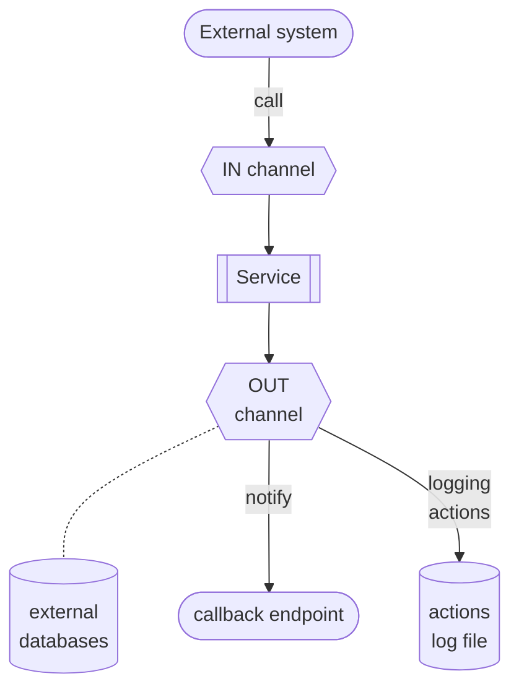

{ width="55" align=left }
<small markdown>**ALPHAREN Integrator (ARINT) System** 
*(c) 2021 RENware Software Systems. RESTRICTED only for project internal use*
</small>      

# Integrator System Overview

***Table of contents:***

[TOC]

***

**ALPHAREN Integrator** (aka **`ARINT`** or **`arint`**) system is a product (available as *software* or*appliance*) aimed to assure integration of different and various informational services between systems.

It acts as a high level *ESB or ESOA* to connect different services and to make them to work ***as one*** without the human intervention, ie, is automated.

ALPHAREN Integrator general process flow 

## Fundamental features

* **ANYWHERE**. can work even the systems that must be integrated are in different non routable LANs (address systems at `http` protocol level)

* **ANYHOW**. is agnostic to format, composition, structure, encoding of information required / provided by systems that must be integrated

* **ANYTIME**. can work as a distributed high scalable cluster of "**ALPHA-REN Integrator Machines**"

* **SECURED**. can work with any public standard (ie, defined at least as `RFC`) of Internet security

## Detailed features

For [features list see](./810.46-Product_Features.md)

## Typical use cases

***ALPHAREN Integrator*** is used for enterprise, business integrations, data science, IoT and other scenarios that require integrations of multiple systems.

Real-world, production ***ALPHA-REN Integrator*** environments include:

* A platform for processing payments from consumer devices

* A system for a telecom operators integrating CRM, ERP, Billing and other systems as well as applications of the operator’s external partners

* A data science system for processing of information related to securities transactions (FIX)

* A platform for public administration systems, helping achieve healthcare data interoperability through the integration of independent data sources, databases and health information exchanges (HIE)

* A global IoT platform integrating medical devices

* A platform to process events produced by early warning systems, (ex SAP EWS)

* Backend e-commerce systems managing multiple suppliers, marketplaces and process flows
B2B platforms to accept and process multi-channel orders in cooperation with backend ERP and CRM systems

* Platforms integrating real-estate applications, collecting data from independent data sources to present unified APIs to internal and external applications

* A system for the management of hardware resources of an enterprise cloud provider

* Online auction sites

* E-learning platforms

* ad-hoc data API for databases, protecting them to direct access

