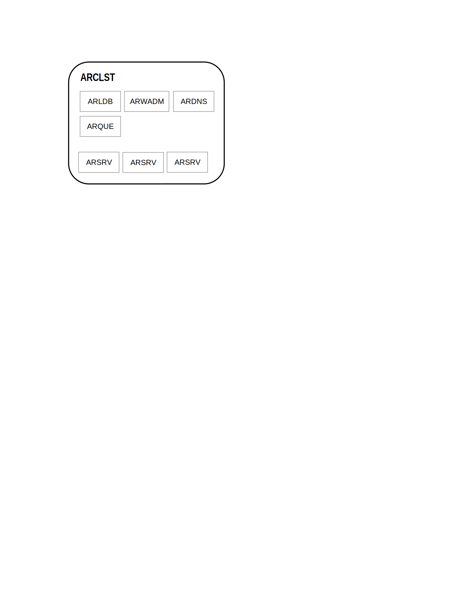

{ width="55" align=left }
<small markdown>**ALPHAREN CORE-Integrator (ARINT) System** 
*(c) 2021 RENware Software Systems. RESTRICTED only for project internal use*
</small>   

# System Landscape

***Table of contents:***

[TOC]

***

## System components

### Elementary component, heart of the system

The elementary, indivisible element, "heart" of the *ARINT* system is **ARCLST**. This is an *cluster node* which is exactly as the says, a cluster, having independence and ability to solve all problems that ARINT implementation is designed to address.

An *ARCLST* can be linked with other ARCLST nodes and can work in any mode, ie as *active-active* or *active-passive* at the administrator option to configure system.

!!! warning "ARCLST physical locations"
    An *ARCLST* must have all machines (servers) **located in the same LAN**. All machines inside should be able to communicate between them at IP level. Many implementations (and is a practice) isolate the *ARCLST* from the installation phase in a dedicated operating system container (ie, not application container) - `Ubuntu LXC` being a very good example of this kind of container.

#### ARCLST essential components

* `[1 to n]` **ARINT Framework** servers[^1] (these will work ONLY in *active-active* mode)

* `[0 to 1]` **ARINT RDatabase** relational database server(s)

* `[1]` **ARINT KVDatabase** NoSQL database server(s)

* `[1]` **ARINT CORE** administration and management service and its user interface (once installed and activated becomes physically part of *ARINT Framework*)

* `[0 to n]` **ARINT products** various other products, applications, etc (once installed and activated becomes physically part of *ARINT Framework*)

!!! note "Notes regarding used terms"
    * notation `[n...]` specify a quantity range of allowed resources, instances and follow the usual practices in range specifications
    * if not otherwise specified by *server* term is understood a *logical server*, meaning that can be a physical or any form of virtual one, but a dedicated machine perceived as having its own operating system isolation level (for example its own dedicated `root` for
*Xenix* kind of machines, an application container, etc)

#### ARCLST auxiliary components

Auxiliary[^2] components can help in various implementation projects depending exclusively of client (customer) options and its infrastructure existing assets.

* `[0 to 1]` *internal DNS (or dynamic DNS)* which is a standard DNS inside the *ARCLST*. No ARINT component will use it but will allow for a "nice" outside LAN addressing of *ARCLST* components when customer explicitly wants and needs that, otherwise ARINT has a proxy and balancer included which assure its addressing as sysyem and for business purposes

* `[0 to 1]` *internal VPN server* that will allow to "enter" in *ARCLST* LAN space. That's not needed for normal purposes but only if customer need for its own infrastructure operations and easy management

Normally these components are left at router glance as being normal included functionalities in enterprise / business router.

-#TODO - ck all section (upper heading 3 level) for completion 
-#TODO - make a picture here with described items 
=#TODO - then continue review ...

 

## Basic components (#FIXME in review tbdrop)

Basic logical components of this system are:

* **(ARCLST)** Integrator Cluster subsystem
    * **(ARSRV)** Physical or virtual Server
    * **(ARLDB)** High Availability assurance service
    * **(ARWADM)** Web admin console interface
    * **(ARSCHED)** Scheduler
    * **(ARKVD)** Key-Value Data store
    * **(ARPuSuB)** Publisher Subscriber Queues
    * **(ARVPN)** Integrator VPN access

* **(ARDPX)** Discovery Service, Distribution proxy (dynamic DNS)
* **(ARMAIL)** Integrator mail
* **(#TODO)** Configuration portal #NOTE: not yet assigned code

## System Blueprints

### ARint blueprint

-#TODO a high level blueprint

### ARCLST blueprint

-#TODO start and make new descriptions (based on existing) for each component

-#TODO - from here continue review

------
## ARCLST. Integrator Cluster

This component creates a local cluster formed by one or more **ARSRV** machines. Particularly can stand on one single machine with **ARSRV**.  

This is not recommended because **ARCLST** is a *network-bounded* system and **ARSRV** is a *cpu-bounded* one, and a *cluster to cluster* integration will have to suffer.

This component can run **1 per LAN machine**.

## ARSRV. Integrator Server

This is the core / heart of each machine. It will assure information getting, processing and sending or streing.  

Other functionalities (in cooperation with **ARCLST**) cover scheduling, asynchronous processing and retrying in case of un-availability of an external system.

This component can run **n per cluster**.

## ARLDB. Integrator High Availability assurance subsystem

This component assure:

* load balancing,
* failure detection,
* service availability,
* RTT ordering access to in case of multiple **ARSRV** modules.

All **ARSRV** components work *ACTIVE ACTIVE* inside any **ARCLST**. Of course, clusters work independently each of the others.

Also, each **ARLDB** keeps a dynamic trace of any **ARCLST** from the system, so a new cluster can be added without the need of any downtime. 

This thing is also applicable inside a cluster where at any time, with any downtime, a new **ARSRV** can be added. If is right configured then will be automatically discovered and made part of cluster.

This component can run **1 per cluster**.

## ARWADM Web amin console

This will assure cluster administration, for all its servers and other components.

This component can run **n per cluster**. The reason for more ARWADM is to secure each of them.

## ARDPX. Access and distribution proxy

This module is useful when an **ARCLST** is buit on **ARSRV**s physically implemented as a set of small virtual
 machines on a single server, having their LAN. Sure, ALPHA-REN hardware will assure that, but if you're using other hardware it will be needed. 

Thiz module will stay in own LAN DMZ being directly exposed on **ARCLST** IP external access.

This module is responsible for:

* access
 the system outside its LAN without the need of a router with port forwarding.
* assurance of all reverse proxy operations.
* access on the **ARCLST** and **ARSRV**s outside cluster LAN.

This component can run **1 per machine**.

## ARMAIL Integrator mail

This module is responsible for sending administrative and notification mails from **ARCLST** cluster. 

This component can run **1 per machine**.

## ARVPN. Integrator VPN access

This module assure VPN access into the **ARCLST** cluster.

## Deployment over multiple LAN environments

In an environment with multiple LANs, in deployment architecture and process should consider the following aspects:

* every LAN should have at least its own **ARSRV** in order to communicate with other LANs
* an **ARCLST** can assure balancing and failure services inside LAN
* in order to assure balancing and failure services over LANs, each one must have its own **ARCLST** (wirh all other required components to assure corresponding services) which communicate with the others.
* a queue service is strictly required both to assure messages transport inside LAN, but also between LANs; for this reason cannot be used any queuing system but one with remote (over LANs) capabilities (aka named broker system)

## Notes and remarks

[^1]: ARINT Framework machines was in previous versions called ARSRV

[^2]: These components are considered "auxiliary" because in most cases they are not needed anymore and in consequence are not part of installation process (to not induce useless overhead at system resources level)

