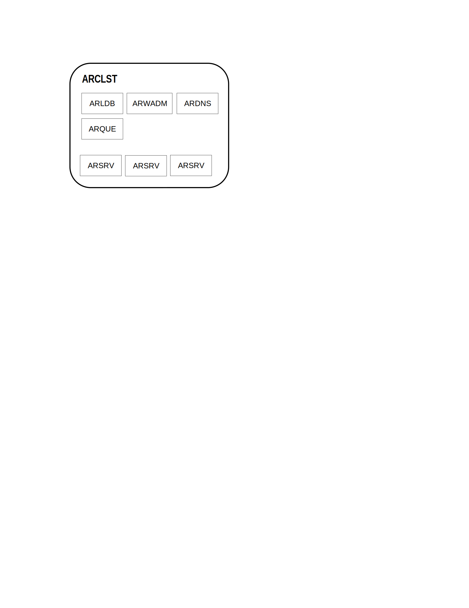

<<<<<<<< HEAD:doc_source/810-DSGN/system_landscape.md
<small>**ALPHAREN ARINT System** 
*(c) 2021 RENware Software Systems. RESTRICTED only for project internal use*
</small>

<h1>Landscape</h1>

<small>***Document control:*** 
* last update date: 230607 
* last updated by: petre iordanescu
</small>

[TOC]

# Basic components
========
{ width="55" align=left }
<small markdown>**ALPHAREN Integrator (ARINT) System** 
*(c) 2021 RENware Software Systems. RESTRICTED only for project internal use*
</small>   

# System Landscape

<small>***Document control:*** 
* last update date: 230607 
* last updated by: petre iordanescu
</small>

***Table of contents:***

[TOC]

***

## Basic components
>>>>>>>> petre-dev:doc_src/810-DSGN/system_landscape.md

Basic logical components of this system are:

* **(ARCLST)** Integrator Cluster subsystem
    * **(ARSRV)** Physical or virtual Server
    * **(ARLDB)** High Availability assurance service
    * **(ARWADM)** Web admin console interface
    * **(ARSCHED)** Scheduler
    * **(ARKVD)** Key-Value Data store
    * **(ARPuSuB)** Publisher Subscriber Queues
    * **(ARVPN)** Integrator VPN access

* **(ARDPX)** Discovery Service, Distribution proxy (dynamic DNS)
* **(ARMAIL)** Integrator mail
* **(#TODO)** Configuration portal #NOTE: not yet assigned code

<<<<<<<< HEAD:doc_source/810-DSGN/system_landscape.md
# System Blueprints

## ARint blueprint

-#TODO a high level blueprint

## ARCLST blueprint

========
## System Blueprints

### ARint blueprint

-#TODO a high level blueprint

### ARCLST blueprint

>>>>>>>> petre-dev:doc_src/810-DSGN/system_landscape.md

-#TODO start and make new descriptions (based on existing) for each component

-#TODO - from here continue review

------
# ARCLST. Integrator Cluster

This component creates a local cluster formed by one or more **ARSRV** machines. Particularly can stand on one single machine with **ARSRV**.  

This is not recommended because **ARCSLT** is a *network-bounded* system and **ARSRV** is a *cpu-bounded* one, and a *cluster to cluster* integration will have to suffer.

This component can run **1 per LAN machine**.

<<<<<<<< HEAD:doc_source/810-DSGN/system_landscape.md
# ARSRV. Integrator Server
========
## ARSRV. Integrator Server
>>>>>>>> petre-dev:doc_src/810-DSGN/system_landscape.md

This is the core / heart of each machine. It will assure information getting, processing and sending or streing.  

Other functionalities (in cooperation with **ARCLST**) cover scheduling, asynchronous processing and retrying in case of un-availability of an external system.

This component can run **n per cluster**.

<<<<<<<< HEAD:doc_source/810-DSGN/system_landscape.md
# ARLDB. Integrator High Availability assurance subsystem
========
## ARLDB. Integrator High Availability assurance subsystem
>>>>>>>> petre-dev:doc_src/810-DSGN/system_landscape.md

This component assure:

* load balancing,
* failure detection,
* service availability,
* RTT ordering access to in case of multiple **ARSRV** modules.

All **ARSRV** components work *ACTIVE ACTIVE* inside any **ARCLST**. Of course, clusters work independently each of the others.

Also, each **ARLDB** keeps a dynamic trace of any **ARCLST** from the system, so a new cluster can be added without the need of any downtime. 

This thing is also applicable inside a cluster where at any time, with any downtime, a new **ARSRV** can be added. If is right configured then will be automatically discovered and made part of cluster.

This component can run **1 per cluster**.

<<<<<<<< HEAD:doc_source/810-DSGN/system_landscape.md
# ARWADM Web amin console
========
## ARWADM Web amin console
>>>>>>>> petre-dev:doc_src/810-DSGN/system_landscape.md

This will assure cluster administration, for all its servers and other components.

This component can run **n per cluster**. The reason for more ARWADM is to secure each of them.

<<<<<<<< HEAD:doc_source/810-DSGN/system_landscape.md
# ARDPX. Access and distribution proxy
========
## ARDPX. Access and distribution proxy
>>>>>>>> petre-dev:doc_src/810-DSGN/system_landscape.md

This module is useful when an **ARCLST** is buit on **ARSRV**s physically implemented as a set of small virtual
 machines on a single server, having their LAN. Sure, ALPHA-REN hardware will assure that, but if you're using other hardware it will be needed. 

Thiz module will stay in own LAN DMZ being directly exposed on **ARCLST** IP external access.

This module is responsible for:

* access
 the system outside its LAN without the need of a router with port forwarding.
* assurance of all reverse proxy operations.
* access on the **ARCLST** and **ARSRV**s outside cluster LAN.

This component can run **1 per machine**.

<<<<<<<< HEAD:doc_source/810-DSGN/system_landscape.md
# ARMAIL Integrator mail
========
## ARMAIL Integrator mail
>>>>>>>> petre-dev:doc_src/810-DSGN/system_landscape.md

This module is responsible for sending administrative and notification mails from **ARCLST** cluster. 

This component can run **1 per machine**.

<<<<<<<< HEAD:doc_source/810-DSGN/system_landscape.md
# ARVPN. Integrator VPN access
========
## ARVPN. Integrator VPN access
>>>>>>>> petre-dev:doc_src/810-DSGN/system_landscape.md

This module assure VPN access into the **ARCLST** cluster.

<<<<<<<< HEAD:doc_source/810-DSGN/system_landscape.md
# Deployment over multiple LAN environments
========
## Deployment over multiple LAN environments
>>>>>>>> petre-dev:doc_src/810-DSGN/system_landscape.md

In an environment with multiple LANs, in deployment architecture and process should consider the following aspects:

* every LAN should have at least its own **ARSRV** in order to communicate with other LANs
* an **ARCLST** can assure balancing and failure services inside LAN
* in order to assure balancing and failure services over LANs, each one must have its own **ARCLST** (wirh all other required components to assure corresponding services) which communicate with the others.
* a queue service is strictly required both to assure messages transport inside LAN, but also between LANs; for this reason cannot be used any queuing system but one with remote (over LANs) capabilities (aka named broker system)

